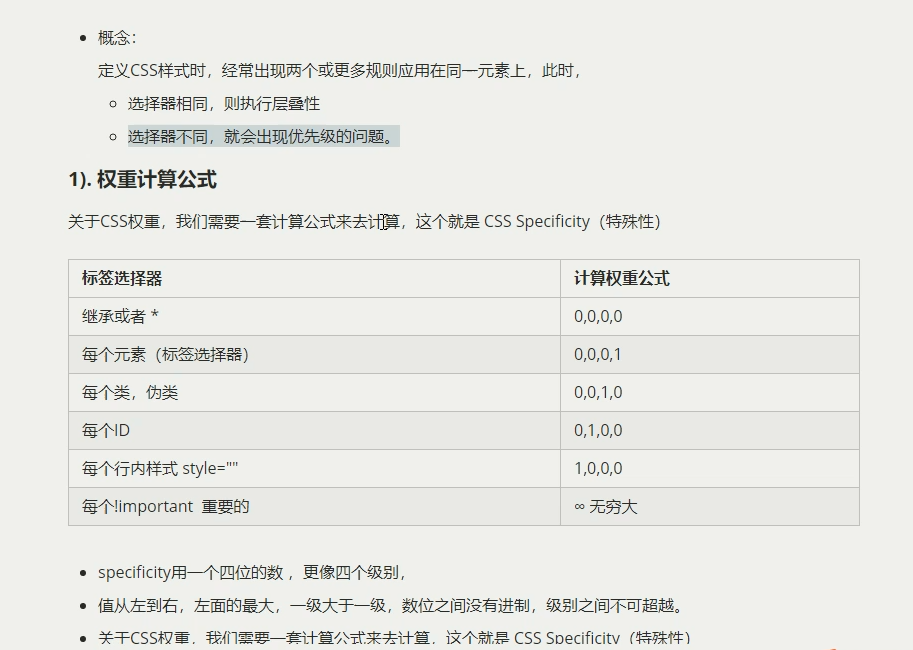

emment语法(提高开发效率)：
div+tab   div*4   ul>li*4   dl>dt+dd   .demo   #demo   用$符号  .demo$*3
CSS作用：
设置HTML页面中的文本内容版面的布局和外观显示样式
CSS三大特性：
  1、层叠性：样式冲突时，按照就近原则(后写的)；样式不冲突不会层叠
  2、继承性：子标签会继承父标签的一些属性(text-,font-,line-,color都可以继承)  可以降低CSS的复杂性
  3、优先级：
    1) 如果选择器相同 执行层叠性
    2) 如果选择器不同 执行优先级   
使用CSS的方式：
  1、内联样式  通过style属性来设置元素的样式  多组用分号隔开,用:不用=
  2、内嵌样式表  写在head中,并且用style标签定义
     
  3、外链式  放在一个或多个CSS文件中    通过link引入，放在head中   可实现样式共享
      <link rel="stylesheet" type="text/css" href="style.css" />
  4、代码风格： 一般展开格式，全部用小写

CSS外观属性：
  1、color：预定义颜色(red,blue....)  十六进制(#000000为黑色 #FFFFFF为白色  可以简写,如#FFF)  RGB代码(rgb(255,0,0)或者rgb(100%,0%,0%))   可以用FScapture吸取颜色
  2、text-align：文本水平对齐方式   left、right、center  (盒子里面的内容对齐,而不是盒子对齐)
    基线到基线的距离为行高 单行文本垂直居中：行高等于盒子的高度   行高>盒子高度 偏下   反之
  3、line-height：行间距   一般行间距比字号大7-8个px
  4、text-indent：首行缩进   一般用em(字符宽度的倍数)作为单位   1em就是一个汉字的宽度
  5、text-decoration：文本的装饰
    none(什么都没有,一般用来取消下划线),underline(下划线),overline(上划线),line-through(删除线)

选择器：
  作用：找到特定的HTML页面元素
  1、基础选择器
    1)标签选择器:不能进行差异化选择，只能选择大类
    2)类选择器(.)：
      不要用纯数字和中文命名
      多类名用空格隔开
    3)id选择器(#):
      类选择器和id选择器的区别： id是唯一的(常用于与JS搭配使用)，class可以重复调用
    4)通配符选择器(*):  选择所有标签(降低页面响应速度,不建议随便使用)
  2、复合选择器
    1、后代选择器(重点)  父级 子级{属性:属性值;属性:属性值;.....}
    2、子元素选择器      用 > 表示  只选择最近的一级
    3、交集选择器        用 . 表示  p.one(.one的段落标签)    一般不用
    4、并集选择器(重点)  用 , 表示   表示和
    5、链接伪类选择器
      a:link(未访问的链接),a:visited(已访问的链接),a:hover(鼠标移动到链接上).a:active(点击不松开)   尽量lvha的顺序写 属于交集选择器

字体样式：
  1、font-size：字体大小  基本使用px作为单位  一般给body定义字体大小16px
  2、font-family：字体
    多个值时，用逗号隔开。从左往右一个个往下找直到找到字体，如果没有则用电脑自带的。
    可以用unicode设置，要加引号
  3、font-weight：字体粗细
    normal、bold、100-900(400=normal,700=bold)
  4、font-style: 是否倾斜
    normal、italic
  5、合体写法：
    选择器 {font: font-style font-weight font-size/line-height font-family }  必须保留font-size和font-family

标签类型
  1、块级元素(block)    div,h1-h6,p,ul,ol,li   显示模式：dispaly:block
    特点：独占一行;height、width、margin、padding都可以控制;width默认是(父级宽度的)100%;是一个容器,内部可以放行内或者块级元素
    例外：p,h,dt等里面不能放块级元素,只有文字才能组成它们
  2、行内元素(inline)   a,strong,b,em,i,del,s,ins,u,span     显示模式：dispaly:inline
    特点：一行可放多个行内元素;宽高设置无效;默认宽度为其本身宽度;行内元素里只能放文本和其他行内元素
    注意：a中不能在放a;特殊情况a里可以放块级元素(需要转换成块级元素)
  3、行内块元素(inline-block)   img,input,td    显示模式：dispaly:inline-block
    特点：可以对它们设置宽高和对齐属性以及内外边距;默认宽度为其本身宽度;和相邻的行内元素之间有空白缝隙

CSS背景：
  1、background-color   transparent(默认,透明)或者直接写颜色
  2、background-image   none(默认)或者url(图片链接,不用加引号)
  3、background-repeat  repeat(默认,平铺),no-repeat,repeat-x(横向平铺),repeat-y(纵向平铺)
  4、background-position(重点)  可混用
    1、精确值    x坐标(左到右变大),y坐标(上到下变大)  顺序不能变，如果只写一个值，则表示x坐标，y居中
    2、方位名词  top,center,bottom,left,center,right  要写两个值，与顺序无关，如果只写一个值，另一个值默认居中对齐
  5、background-attachment(背景附着)   fixed(背景固定)  scroll(滚动,默认的)
  6、background: rgba(0,0,0,0.3) 背景半透明  最后一个值为透明度   值为0-1之间的一个数，可以省略0 直接写.3

  合体写法 background { 颜色 地址 平铺 滚动 位置}   没有强制要求

盒子模型    由margin、border、padding、内容组成    实际大小为 内容的宽高+内边距+边框
  1、border
    border-width(边框宽度)  1px
    border-style(边框类型)  solid(实线) dashed(虚线) dotted(点线)  等等
    border-color(边框颜色)  #000
    合体写法 border: 1px solid red   顺序不强制 border: none;(四个边框都去掉)
    可以单独设置一条边框   border-top,border-bottom,border-left,border-right
    表格中 table { border-collapse: collapse; }  可以将表格中的相邻边框合并在一起
  2、padding(内边距)   设置了内边距盒子会变大   例外：如果盒子没有宽度则不会撑开盒子
    合体写法
      1个值： padding: 所有的内边距
      2个值： padding：上下  左右
      3个值： padding：上 左右 下
      4个值： padding：上 右 下 左
  3、margin(外边距)
    合体写法
      1个值： margin: 所有的内边距
      2个值： margin：上下  左右
      3个值： margin：上 左右 下
      4个值： margin：上 右 下 左
  4、块级盒子水平居中    
    1、必须有宽度，且左右外边距为auto
    2、必须有宽度，margin：auto
    3、必须有宽度，margin：0 auto
  5、插入图片和背景图片的区别 
    1、产品展示用插入图片  靠盒子模型padding和margin控制位置
    2、小图片背景或者超大背景图片用背景图片   用background-position控制位置
  6、清楚元素默认的内外边距(重要)
    * {
      padding：0;
      margin:0;
    }
  7、外边距塌陷
    相邻盒子垂直外边距合并问题    解决方法：只给其中一个盒子添加垂直外边距
    嵌套块元素垂直外边距合并问题  1、给父级块元素定义上边框   2、给父级块元素一个padding-top   3、给父级块元素添加overflow: hidden(常用)  等等
  8、优先使用级   width(没有问题，但是只有它不能达成很多效果)>padding(会改变盒子大小)>margin(会产生塌陷问题)
  9、取消列表样式： li { list-style:none; }
  10、圆角边框   border-radius:100px(半径值)或者50%(圆)  高度的一半可以成圆角矩形
  11、盒子阴影   box-shadow
      h-shadow(水平阴影,可以负值,必填),v-shadow(垂直阴影，可以负值,必填),blur(虚实),spread(影子大小),color(颜色,可以用rgba),inset(内阴影,默认为outset但不能写)

书写规范
  空格规范  在选择器与{}中必须有空格   :后面加空格
  选择器规范  并集选择器的每个选择器必须独占一行    嵌套不要超过三层

浮动(float)
  1、布局的三种机制
    1)标准流:块级元素独占一行，从上而下排列；行内元素从左到右排列,超过父级元素宽度自动换行
    2)浮动: 脱离普通标准流；移动到指定位置   可以实现多个盒子水平排列成一行，左右对齐，文字环绕图片的效果
      float： none  left  right
      漂浮在标准流的上面,原来的位置会被标准流的盒子占有，属于行内块元素
    3)定位:
