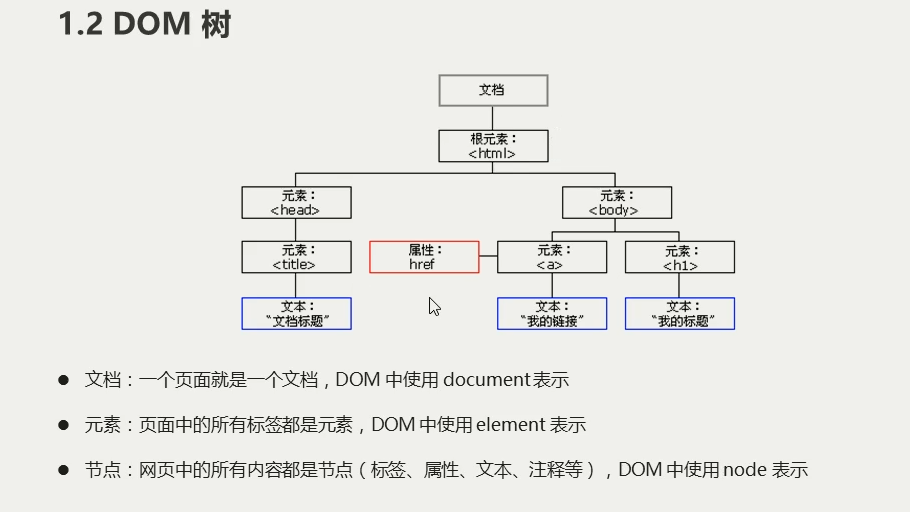
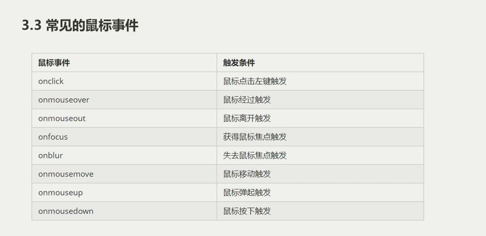

1、DOM文档对象模型  处理网页的接口,可以改变网页的内容、结构和样式
  
  console.dir() 可以显示对象所有的方法和属性

获取元素
  1、通过ID获取   案例01
    document.getElementById('id名')
    document.querySelector('#id名')  
  2、通过标签名 用伪数组存储  案例02
    document.getElementsByTagName('标签名')
    得到的元素对象是动态的
    也可以用element.getElementsByTagName('标签名')
    document.querySelector('标签名')   返回第一个元素对象
    document.querySelectorAll('标签名') 返回所有元素对象
  3、通过类名 用伪数组存储  案例03
    document.getElementsByClassName('类名')
    document.querySelector('.类名')  返回第一个元素对象
    document.querySelectorAll('.类名')  返回所有元素对象
  4、获取特殊元素  案例04
    1、获取body元素
      document.body
    2、获取HTML元素
      document.documentElement

事件处理 
  1、事件三要素：事件源  事件类型  事件处理程序 案例05 06
  2、常见的鼠标事件  onclick()等等  

操作元素
  1、修改元素内容   案例 07 08(一定要看)
    element.innerText  不识别HTML标签,去除空格和换行
    element.innerHTML  识别HTML标签，保留空格和换行
  2、修改元素属性   案例 09 10
    事件源.属性
  3、表单元素的属性操作 案例 11 12
    表单元素的内容通过input.value值改变
    也可用this  指向事件函数的调用者

